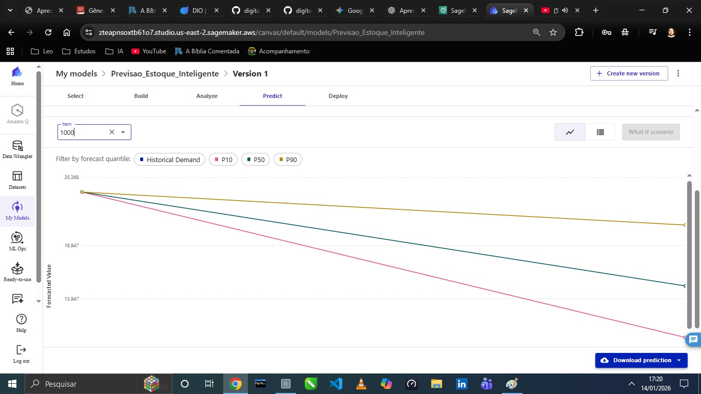
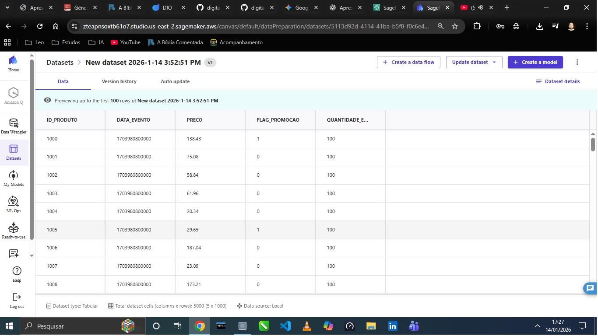
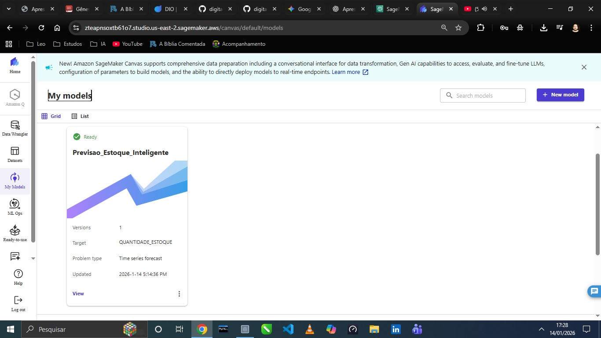
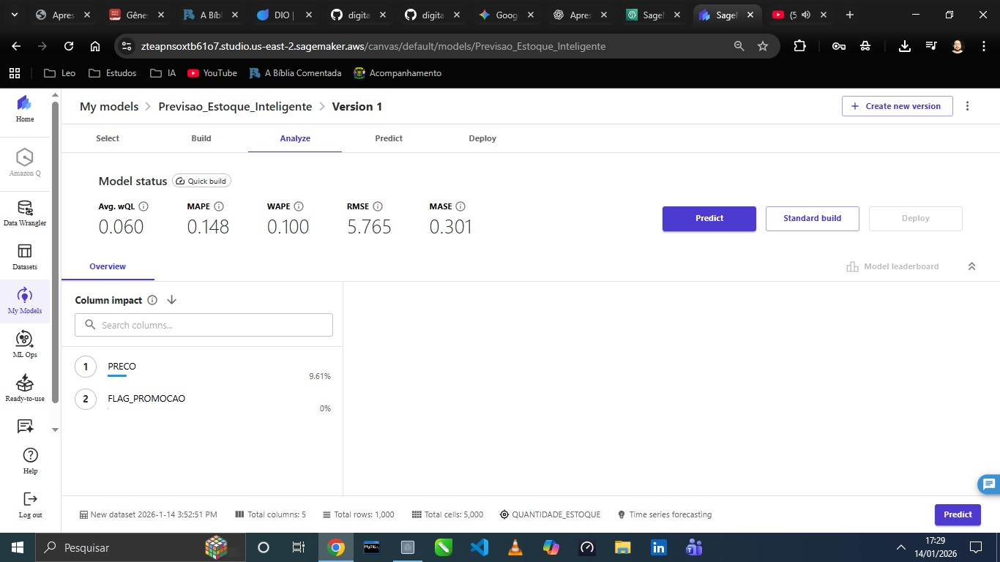
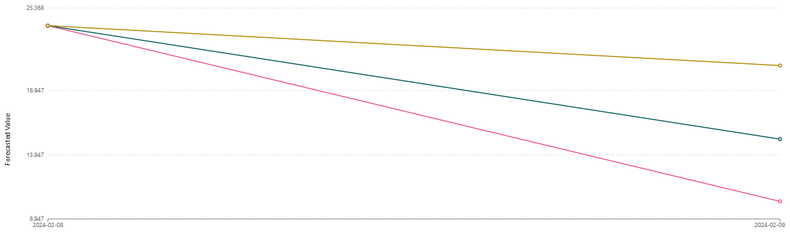

# 📊 Previsão de Estoque Inteligente com AWS SageMaker Canvas

Este projeto demonstra o uso do **Amazon SageMaker Canvas** para criar modelos de previsão de estoque baseados em Machine Learning sem a necessidade de escrever código (No-Code ML).

## 🎯 Objetivos
O objetivo principal foi prever a demanda futura (`QUANTIDADE_ESTOQUE`) para otimizar a reposição de produtos, utilizando dados históricos de vendas e preços.

## 🛠️ Tecnologias Utilizadas
* **AWS SageMaker Canvas**: Plataforma de ML utilizada para treinamento e análise.
* **Amazon S3**: Para armazenamento dos datasets na região de Ohio (us-east-2).
* **GitHub**: Para versionamento e documentação do projeto.

## 🚀 Passo a Passo Realizado

### 1. Configuração do Dataset
O dataset foi configurado identificando a coluna `ID_PRODUTO` como identificador único e `QUANTIDADE_ESTOQUE` como a meta de previsão (Target).

### 2. Gerenciamento de Modelos
No console do SageMaker Canvas, organizamos as versões e o status de treinamento do projeto.

### 3. Análise de Performance
Após o treinamento utilizando o **Quick Build**, o modelo apresentou métricas sólidas de precisão:

* **MAPE (Erro Médio Percentual Absoluto):** `0.148` (Precisão de aproximadamente 85%).
* **WAPE:** `0.100`.
* **RMSE:** `5.765`.

### 4. Resultados das Previsões
Na aba **Predict**, foi gerado um gráfico de tendência para itens individuais, mostrando o comportamento esperado do estoque para os próximos dias.

## 🧹 Gestão de Recursos (FinOps)
Seguindo o modelo de responsabilidade compartilhada da AWS, os recursos foram encerrados após a captura das evidências para evitar custos desnecessários:
* **Log out** realizado no SageMaker Canvas.
* **Deleção** do modelo e do dataset na conta AWS.
